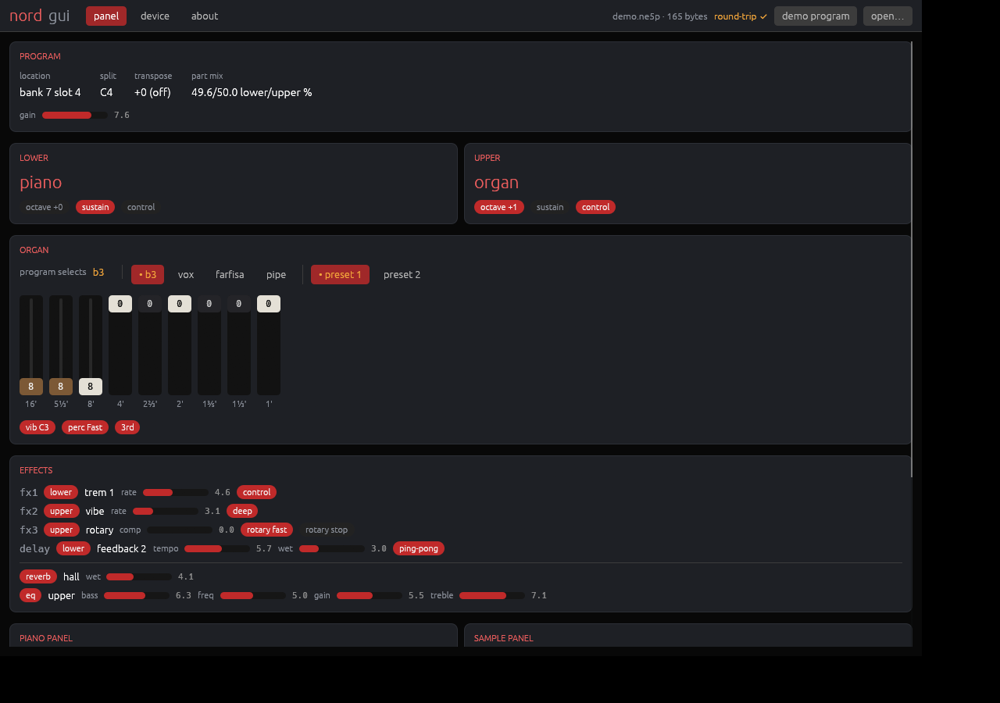

# nord-gui

A proof of concept: one [egui](https://github.com/emilk/egui) application over
[`nord-format`](../nord-format) and [`nord-usb`](../nord-usb), built both as a desktop
binary and as wasm for the browser. Not a product, and not feature complete — it reads,
it never writes.



## What it does

- **Panel** — parse a `.ne5p` / `.ne5t` / `.ne5s` / `.npno` / `.nsmp` file (drag it onto
  the window, or `open…` on the desktop) and render it: drawbars drawn as drawbars, the
  fx chain with its routing, the piano/sample dependency ids. Every file is re-encoded
  the moment it loads and the result compared byte-for-byte with the input — that is the
  `round-trip ✔` badge in the title bar.
- **Device** — run a read-only `nord-usb` operation and show both the answer and the
  bytes it took to get there. Two transports: a recorded NSM capture, replayed in
  **exact** mode so every byte the app transmits is checked against what the real host
  sent; and, on the desktop, real USB (`inventory`, and fetching a program straight into
  the panel tab).

The app starts on a demo program assembled in memory with the library's own setters and
encoded to real `.ne5p` bytes, so there is something to look at with no corpus and no
instrument attached.

## Platform differences

Two, both isolated:

| | desktop | browser |
|---|---|---|
| driving a future (`src/exec.rs`) | `pollster` | one poll cycle — the replay never pends |
| transports (`src/device.rs`) | USB (`nusb`) + recorded capture | recorded capture |

WebUSB would be the browser's transport, but `nord-usb` has no web transport yet — the
`web` feature declares the dependencies and nothing implements `Transport` on top of
them. Everything else, including all the rendering, is the same code on both.

## Running it

Desktop:

```console
nix run .#nord-gui        # or: cd crates && cargo run -p nord-gui
```

Browser — `nix develop` provides `trunk` and the `wasm32-unknown-unknown` target:

```console
cd crates/nord-gui && trunk serve --open
```

Chromium/Chrome is the target: `dist/` is a plain static bundle, so any web server will
do. `trunk build --release` lands at ~4.9 MB of wasm, the debug build at ~21 MB — both
fine over localhost. `index.html` sets `data-wasm-opt="0"`, so trunk never has to fetch
binaryen; drop that attribute to trade a download for a smaller bundle.
