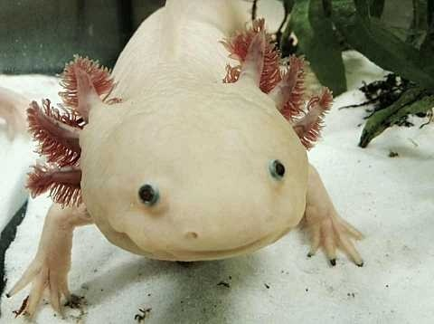

# axolotl

- **Platform:** NixOS, `x86_64-linux`.
- **Module-only:** `axolotl` sets `nixos.enable = true; nixos.eval = false;`, so
  it is exported as `nixosModules.axolotl` (importable elsewhere) but has **no**
  active `nixosConfiguration` and no hardware/disk config of its own.
- Enables the usual desktop feature set (ghostty, hyprland + hyprpaper, shell,
  ssh, vscode, direnv, greetd).

Defined in `hosts/axolotl.nix`.
